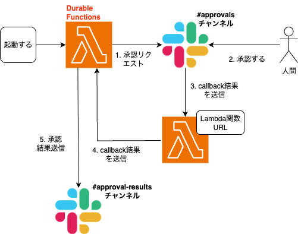

# lambda-durable-functions-human-in-loop



## Slack Webhook を処理するサーバー Lambda の作成

- Slack からのボタン押下（webhook）を受け取る
- Durable Function のコールバックに結果を返す

```bash
# Durable Functionが利用可能なオハイオリージョンを選択
export AWS_REGION=us-east-2

# CDKオハイオ使ってない場合が多いと思いますので、初期化
pnpm cdk bootstrap

# AWS資格情報取得

cd iac
pnpm cdk deploy
```


## Lambda Durable Functionsの作成

- [Deploy and invoke Lambda durable functions with the AWS CLI](https://docs.aws.amazon.com/lambda/latest/dg/durable-getting-started-cli.html)


### 環境変数の設定

```bash
# Durable Functionが利用可能なオハイオリージョンを選択
export AWS_REGION=us-east-2

# AWSアカウントIDを設定
export ACCOUNT_ID="<YOUR AWS ACCOUNT_ID>"
```

### 初回セットアップ（1度のみ）

#### IAMロールの作成

```bash
aws iam create-role \
  --role-name "durable-function-role" \
  --assume-role-policy-document "file://lambda/durable/trust-policy.json"
```

#### IAMポリシーの作成・アタッチ

AWSLambdaBasicExecutionRoleのアタッチ

```bash
aws iam attach-role-policy \
  --role-name "durable-function-role" \
  --policy-arn "arn:aws:iam::aws:policy/service-role/AWSLambdaBasicExecutionRole"
```

#### チェックポイント用ポリシーの作成

```bash
# テンプレートからポリシーファイルを生成
perl -pe "s/REGION/us-east-2/g; s/ACCOUNT_ID/${ACCOUNT_ID}/g" \
  lambda/durable/checkpoint-policy-template.json > lambda/durable/checkpoint-policy.json

# ポリシーを作成
aws iam create-policy \
  --policy-name "durable-checkpoint-policy" \
  --policy-document "file://lambda/durable/checkpoint-policy.json"

# ポリシーをアタッチ
aws iam attach-role-policy \
  --role-name "durable-function-role" \
  --policy-arn "arn:aws:iam::${ACCOUNT_ID}:policy/durable-checkpoint-policy"
```

#### S3バケットの作成

```bash
aws s3 mb "s3://my-lambda-deploy-bucket-${ACCOUNT_ID}"
```

#### Lambda関数の作成（初回ビルド・デプロイ含む）

```bash
# ビルド（依存関係も含めてバンドル）& zipにまとめる
pnpm build && zip function.zip dist/index.mjs

# S3にアップロード
aws s3 cp function.zip "s3://my-lambda-deploy-bucket-${ACCOUNT_ID}/"

# Lambda関数を作成
aws lambda create-function \
  --function-name "myDurableFunction" \
  --runtime "nodejs24.x" \
  --role "arn:aws:iam::${ACCOUNT_ID}:role/durable-function-role" \
  --handler "dist/index.handler" \
  --code "S3Bucket=my-lambda-deploy-bucket-${ACCOUNT_ID},S3Key=function.zip" \
  --durable-config '{"ExecutionTimeout": 900, "RetentionPeriodInDays":1}'
```

### 継続デプロイ（コード変更時）

```bash
# ビルド（依存関係も含めてバンドル）& zipにまとめる
pnpm build && zip function.zip dist/index.mjs

# S3にアップロード
aws s3 cp function.zip "s3://my-lambda-deploy-bucket-${ACCOUNT_ID}/"

# Lambda関数を更新
aws lambda update-function-code \
  --function-name "myDurableFunction" \
  --s3-bucket "my-lambda-deploy-bucket-${ACCOUNT_ID}" \
  --s3-key "function.zip"
```

Slack連携の環境変数設定
```bash
export SLACK_BOT_TOKEN="xoxb-xxx"
export SLACK_CHANNEL="#approvals"

aws lambda update-function-configuration \
  --function-name "myDurableFunction" \
  --environment "Variables={SLACK_BOT_TOKEN=${SLACK_BOT_TOKEN},SLACK_CHANNEL=${SLACK_CHANNEL}}"
```

## その他コマンド

### ポリシーの削除と再作成

```bash
aws iam detach-role-policy \
  --role-name "durable-function-role" \
  --policy-arn "arn:aws:iam::${ACCOUNT_ID}:policy/durable-checkpoint-policy"

aws iam delete-policy --policy-arn "arn:aws:iam::${ACCOUNT_ID}:policy/durable-checkpoint-policy"

aws iam create-policy --policy-name "durable-checkpoint-policy" --policy-document "file://lambda/durable/checkpoint-policy.json"

aws iam attach-role-policy \
  --role-name "durable-function-role" \
  --policy-arn "arn:aws:iam::${ACCOUNT_ID}:policy/durable-checkpoint-policy"
```

### Lambdaの削除

```bash
aws lambda delete-function \
  --function-name "myDurableFunction" \
```
